# Chapter One - The Prison
Edit Page

## Statues: 2 Nomes: 3

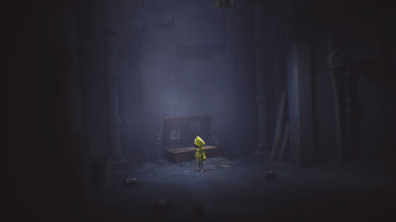

You start out in a dark room, waking up from your bed, errr, suitcase. To proceed, head right and turn on your Lighter with the circle button. You'll come across a lantern you should lit. The iron lid on the right side can be opened by pulling with R2. Crawl through (L2), move up and keep your lighter lit to see what you're actually doing.

You'll reach a large open area with a door you cannot open. Move to the right, up the stairs and proceed past the boxes until you can spot a Statue in the background. You can pick this up and move to the left (back to the stairs) and release it/drop it in the depths. You'll hear it smash on the ground far below a few seconds later, indicating you've smashed it to bits. There are two such statues in this chapter.

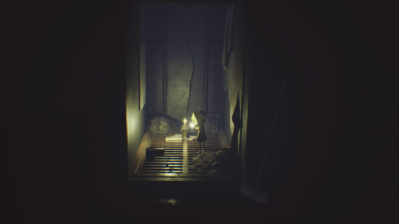

Move through the small hole on the right, continue through the bedroom with the chairs hanging from the ceiling, climb the bed and crawl through the ventilation shaft on the right by jumping/grabbing its ledge. The next room has a man who's hanged himself - the poor fellow. Use the chair in the middle (grab/push it to the door) in order to reach and grab the door handle, then go through to the next room.

Here, proceed until you reach a fridge with dirty handstains on it. Open it up, but don't climb up just yet. First check out the opening on to the right. Crawl through and you'll find a creature known as a Nome in this room, right next to the lantern you can light. Hug the Nome as it counts as a collectible. It only appears after opening the fridge.

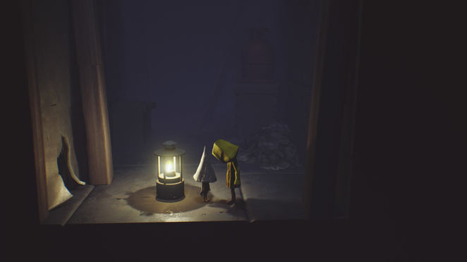

Then climb to the top and keep continuing on the uper right of this level. You'll come across some leeches dropping from the ceiling at some point, but you can outrun them easily. The next room has a lever in the middle. Pull it and continue to the next walkway.

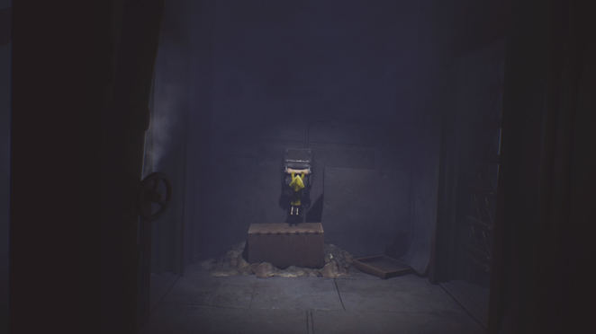

Hop over the gap and proceed into the next room. The gate to the left will drop down, so you're stuck - or so it appears. Pull off the bottom plank on the right side to continue.

In the next room you'll spot a Nome running away from you. Unfortunately, when you continue you'll crash down to a room below with various slimes/leeches. Quickly rush to the right side of the room, jumping over any slimes you come across and push the door to continue.

Hop over the gap and light the lantern in the back, then climb the wooden ladder up and follow the plank to the left. Go upstairs and at the path split, first head towards the screen. Walk towards the very end, then jump right to continue upstairs.

Be sure to light your lighter on the upcoming path, as it isn't linear. Turn the lever counterclockwise until it won't budge any more, then run back (with Square) and *jump* over the gap, rushing towards the door that has opened on the far right side. You should make it back just in time if you dash as fast as you can (simply holding Square will do the trick).

In this room, be sure to pull open the hatch in the back to reveal a Nome. Continue via the hole in the right wall and continue until you'll spot something up above. Ignore this for now and head up the makeshift rope to reach the next room. Light the candle in the back, to the left of the sink and continue through the half-opened door on the right side of the room to enter the kitchen.

Close the door to spot a switch behind it. Pull the box with toilet paper towards it so you can jump and grab it. Beware, however, that you'll need to be quick after doing this.

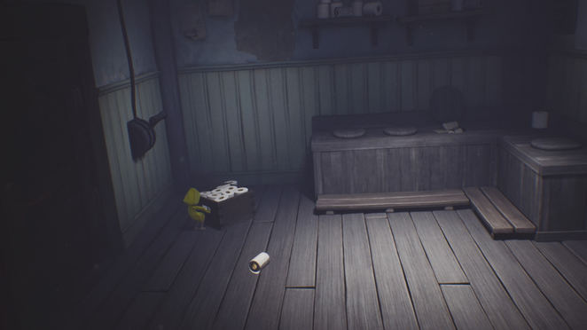

You need to rush not only through the first set of electrified bars to the right, but also through the entire room beyond it to squeeze through a second set of electrified bars. If you keep up the pace it's not too hard, but you'll want to know in advance this is required of you. (If you fail and get 'stuck' in the next room, simply climb back via the dresser or via the see-saw to reach the previous room and try again.)

The hallway with the prison doors contains nothing in particular, so proceed to the next room, where a spotlight eye will try to spot you! Stay in the shadows behind the first pillar, then behind the bed in the middle when the coast is clear, and finally to the right.

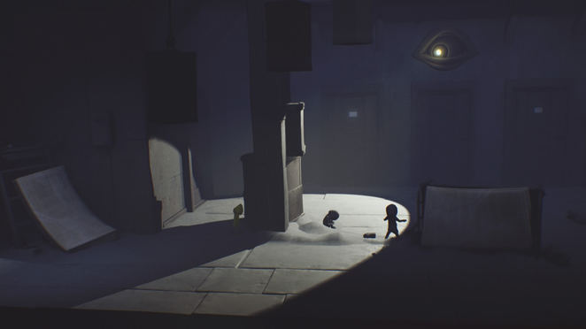

Head up the crates on the somewhat left side here and light the lantern, then climb the grated cages and head up. Don't proceed over the walkway just yet, however.

You can find a Nome if you head over the upper boxes here and jump to the right. Then move through the grated cage here into a room to the right, where you can finally hug the Nome. When you've done so, simply climb back up the grated cages in the previous area.

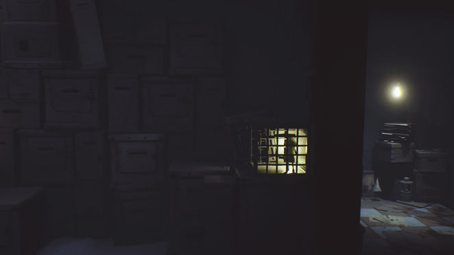

Don't continue to the right just yet, however! Instead, go to the back and follow the walkway to the far left to reach a room with a Statue. Break it by dropping it, then continue to the far right side, where you were just now.

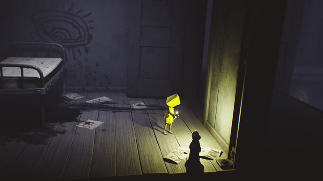

In the next room, someone enters. Quickly hide underneath the bed, wait for the person to pass to the left, then continue to the right. In the next room, climb the grated cages to reach a higher-up walkway that leads to a hole to the right. Crawl through the tunnel and drop down. In this room you'll start to feel very hungry and underfed. Watch the boy in the background, behind bars, eat and wait for him to throw some bread. Eat it, then climb the crates and crawl through the bars.

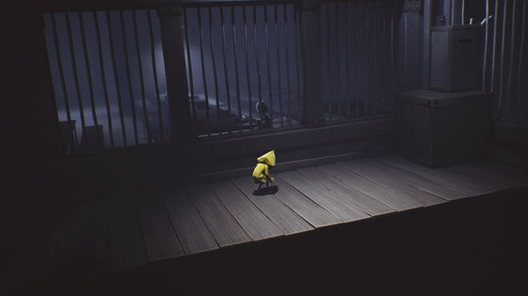

Proceed through the shower room and over the walkway until you reach an electified set of bars. You'll have to climb up the nearby boxes, go to the back, move left, climb up two grated crates, leap to the right and from there climb up more grated crates to the top. In the back of the right corner you can light a candle here. Move to the front, wait for the boxes hanging from a chain to move into your direction and jump to them, then climb the chain up. Again, wait for the chain to move to the right and then jump in that direction to reach the platform. Climb up the grated crates, pull the lever in the background and wait for the boxes to move up.

You can now pull the second lever in the middle of the area. First pull it right, which brings the hanging boxes toward you. Then pull it left and immediately run toward the boxes, jumping on them. If you're in time you'll catch a ride to the other side, where you can climb the chain again and jump to the platform to the left here.

You'll reach an administrative room of some sorts, with a lever on the wall that's too high for you to grab, at least initially. You can pull out drawers from the cabinets, however. Pull out the on on the lowest left to the max and climb it. Then pull the one above it a little bit, but not to the max, so you can climb to the second level and jump to the right from here. This allows you to jump to and reach the lever, which kills the power for good.

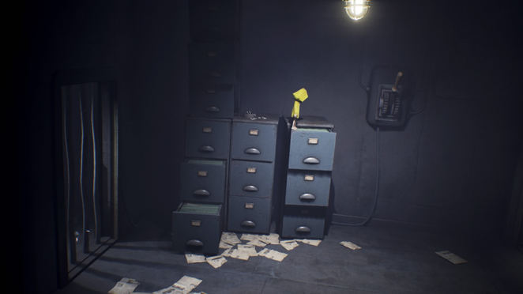

Head into the room to the left and move to the far left to light a lantern. There's a Nome in a cage next to it. Open it up and follow it into the previous room, where it will hide in the left corner. Go give it a hug.

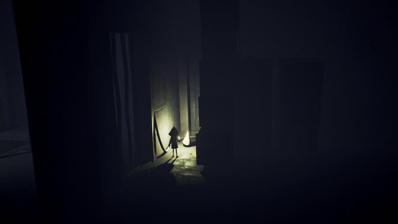

Now head into the room to the left again and push the metal crate down, which will reveal a rope you can then ride down. This is the same shower area leading to the walkway bridge, but this time there will be leeches/slimes, so stay in the middle and jump over any of them. The electrified bars at the end of the walkway can now be passed through.

The next room contains another spotlight and a moving garbage bin that helps you stay in the shadows. In the last portion of this chapter, quickly pass over the bridge, which will rapidly retract. Jump over the widening gap, then onto the crate and from there quickly to safety, to the right. You can then move to the far right to the next chapter.  

# Chapter Two - The Lair

## Statues: 2 / Nomes: 3

Go upstairs and through the first door to the right. In this room, walk towards the Nome under the desk so it flees, then climb up the desk via the desk drawers or the chair and light the lamp. Then grab the lamp and jump down, then place it on the tile with the dirt as in the picture. This opens an opening to the next room.

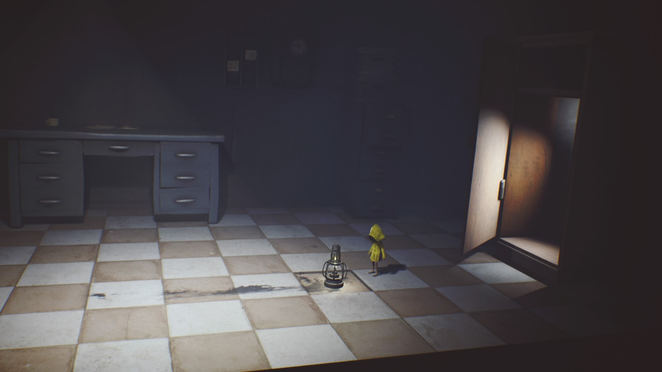

Check behind the eye to spot the Nome again so you can catch it later on, then climb toward the large button and press it several times to get a preview of upcoming areas.

Head back to the stairs and go up, all the way to the left, where you'll find the Nome, whom you can finally hug. That's all you wanted to do - hug!

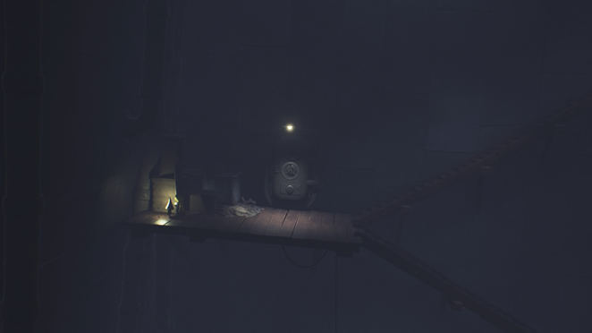

When you've done so, proceed up and go through the small hole to the right. Drop down and a few Nomes will run away.

In this room, pull the suitcase to the handle on the right side and use it to drop down a bed. Use this to climb up the long set of small drawers and onto the adjacent platform to the left. Jump down to the shelf on the left and spot the key on the table down below. Before dropping down there, however, first climb up to the shelf with toilet paper on the upper left. You can find a Statue here that you should break.

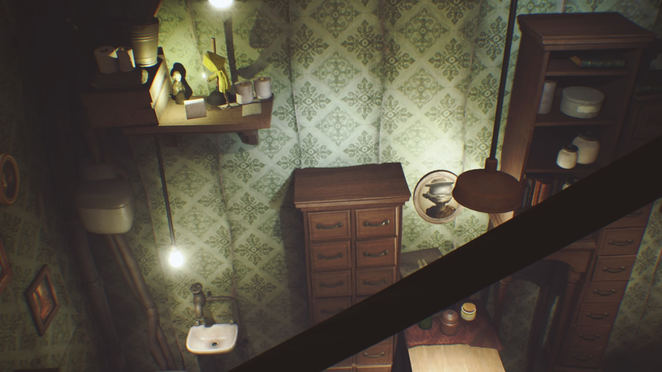

Now drop back down to the table and grab the Key. Push open the door on the right side and walk through with the key, then throw it (with X) on the wooden floor and use it to unlock the next door.

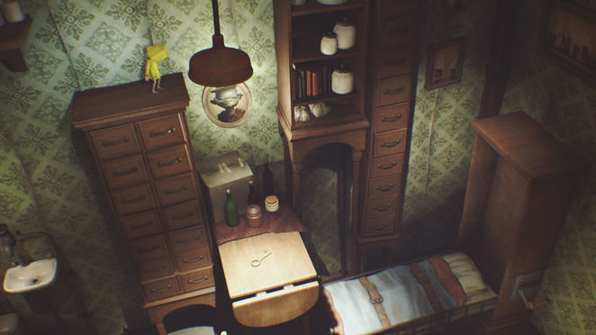

Here, grab the toy monkey and throw it at the elevator button to call it. Bring the toy inside, throw it at the button inside the elevator and ride it down. Walk left and move underneath a pipe, then light the lantern directly past it. In the next room, eat the meat in the cage and watch the short scene.

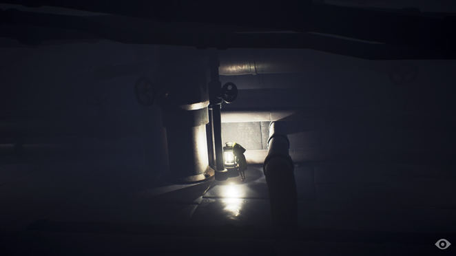

Push the cage to the left and the right until you fall off. Go left and squeeze through the tight opening of the double doors and light the candle just beyond. Head back to the previous room and move the right-most cage underneath the handle. Grab it to open the door, but don't let go of the handle. Instead, swing it several times so you can leap towards the door and quickly move underneath before it closes again.

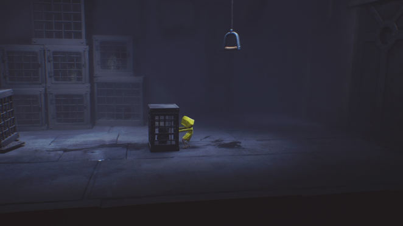

The door closes behind you. Climb it all the way up and jump to the right, then light the candle in the back. Proceed to the next room and stay in the front of the screen as you progress to the right. There's a large enemy in the back with long arms, no sight, but relying on smell. It will eventually smell you as you continue, so rush to the back and move through the hole on the right on the forefront. If the enemy follows you into the next room, move to the far right back and hide in the corner until it goes away.

When it's gone, grab the lever from the floor and put it into the beam on the left side of the room, then start using it to open the hatch. The enemy will come back when you progress, at which point you'll want to make a run for it and drop down the hatch. Continue through the tunnel and drop down at an area with a pipe, a suitcase and a lantern you should lit.

The path forward is obvious, but instead of climbing the suitcase and going through the tunnel, look in the back for a ladder just beyond he pipe. Climb up, then move to the forefront and go through the tunnel to follow a Nome you can hug.

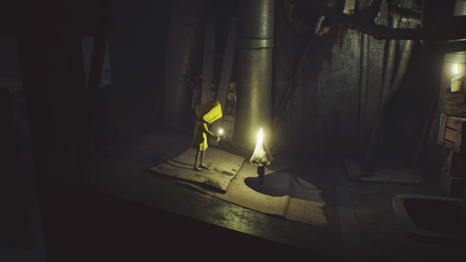

Now drop down the hole in the room and you'll be in the same tunnel you'd go through by climbing the suitcase. Head right to continue.

In this room, which can by all rights be called 'shoe depository', an enemy will come at you if you advance beyond a certain point. What you'll want to do is climb the first suitcase and then run-jump toward the next. Repeat this with the next suitcases, using these as safe spots. With the jumps you should have enough distance to make it to the end.

Proceed and head upstairs. As you continue through the hall, the enemy from before will start chasing you. Run to the elevator and hide in the small box in the far right corner.

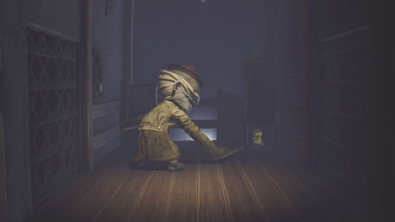

After this, continue into the next room. Push the toy box to the background and stand to where the toy monkey lies to drop to a lower level, a crawling space of some sorts.

Move to the right, past the plank-ladder and move to the back of the crawling space to spot a Statue in the corner. Break it by throwing it.

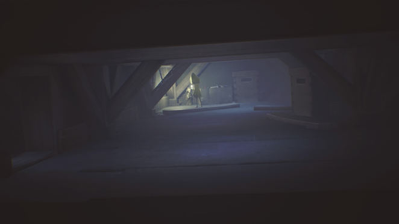

As you'll have seen by now, the long-armed enemy is in the two rooms above, cherishing spoons and other objects. Stand by the ladder and when he moves to the far left corner of this room, rush toward the hole to the right, but don't hit the monkey toy or it'll attract noise. The same applies for the toy in the second room. You need to move quickly to the drawers on the right on the foreground. He'll reach for you, so quickly climb higher, push the object out of the way and go through the hole.

In the next room, continue and go through the door. Mr. long-arms appears again. Have him follow you to the room to the left, then make a run for it to the clock room and use one of the shoes here to hit the button, opening the door for you. Quickly run through the hall and either hide in the corner or push open the door and squeeze through. You'll now be in a room with large piles of books.

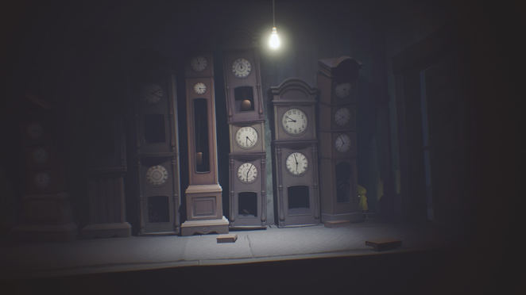

Crawl underneath the desk to the far right to make a Nome appear. It will then hide behind the pile of books in the middle/left side of the room, so give it a hug there.

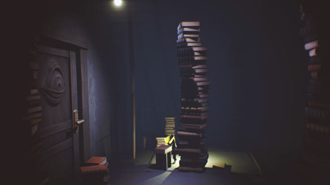

To proceed, climb the pile of books to the right, jump to the right and climb the bookcase to the top. Light the candle here, then jump left to the piano. Climb the staircase and you'll come to an area where Mr. Longarms appears again.

Take note of the hole in which you can soon place a lever, then enter the book area to the left. Climb the book pile in the foreground. There are two candles here; one on the upper planks and one on the ground floor against the book case to the left.

Light both of them, then rush through the hole to the left of the bookshelves and climb the pile of books to go through a hole to the next room.

You'll find the lever you need here on the ground. Place it near the door on the right/background, then turn on the TV by pushing the button on it. Mr. longarms will appear soon, so quickly climb on top of the long shelves in the background (or behind the suitcase in the foreground) and wait for the enemy to inspect the TV.

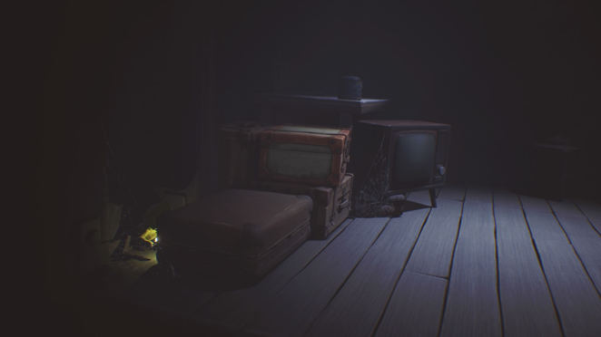

Climb off, crouch and grab the lever, then rush back to the far right, through the book room and to the hole in which you can place the lever. The piano will be raised but the enemy will also be alerted. Quickly jump on top of the piano, wait for it to swing right and then jump right. Climb through the hole to reach the next room.

Here, pull, then push the cart onto the steam, climb over, and pull/push it to the end of the tracks so you can reach the door handle. Only let go of the handle when you're hanging over safe ground.

Move to the end and go into the tunnel. Halfway, light the lantern and after that, watch the cracks as Mr. longarms can grab you through them.

Proceed to the right and you'll end up in a 'boss fight' of some sorts. The door is kept open by a cage while Mr. Longarms tries to grab you. He'll try to reach for you in the background and foreground, alternating these, so you'll want to switch between these two objects in the back/right. During the switch you can dare to quickly jump to the cage to the left and pull a bar out. Go back to the background and wait for a second opportunity to destroy the cage and cut off Mr. No-more-arms limbs. After this, proceed through the hatch on the side to finish this chapter. 